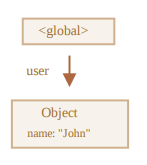
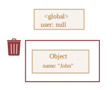

# 가비지 컬렉션

### 가비지 컬렉션 기준

자바스크립트는 *도달 가능성* 이라는 개념을 사용해 메모리 관리를 수행합니다.

'도달 가능한' 값은 쉽게 말해 어떻게든 접근하거나 사용할 수 있는 값을 의미합니다. 도달 가능한 값은 메모리에서 삭제되지 않습니다.

1. 태생부터 도달 가능하기 때문에 명백한 이유없이 삭제되지 않는 것
   
   - 현재 함수의 지역 변수와 매개변수
   
   - 중첩 함수의 체인에 있는 함수에서 사용되는 변수와 매개변수
   
   - 전역 변수

   이런 값은 루트라고 부릅니다.

2. 루트가 참조하거나 값이나 체이닝으로 루트에서 참조할 수 있는 값은 도달 가능한 값이 됨
   
   - 전역 변수에 객체가 저장되어있다고 가정해 봅시다. 이 객체의 프로퍼티가 또 다른 객체를 참조하고 있다면, 프로퍼티가 참조하는 객체는 도달 가능한 값이 됩니다. 이 객체가 참조하는 다른 모든 것들도 도달 가능하다고 여겨집니다.

```js
let user = {
    name = "John";
};
```



이 그림에서 화살표는 객체 참조를 나타냅니다. 전역 변수 `"user"`는 `{ name: "John" }`이라는 객체를 참조합니다. John의 프로퍼티 `"name"`은 원시값을 저장하고 있기 때문에 객체안에 표현했습니다.

`user`의 값을 다른 값으로 덮어쓰면 참조가 사라집니다.

```js
user = null;
```



이제 John은 도달할 수 없는 상태가 되었습니다. John에 접근할 방법도, John을 참조하는 것도 모두 사라졌습니다. 가비지 컬렉터는 이제 John에 저장된 데이터를 삭제하고, John을 메모리에서 삭제합니다.

### 내부 알고리즘

'mark-and-sweep'이라 불리는 가비지 컬렉션 기본 알고리즘에 대해 알아봅시다.

'가비지 컬렉션'은 대게 다음 단계를 거쳐 수행됩니다.

- 가비지 컬렉터는 루트 정보를 수집하고 이를 'mark(기억)'합니다.

- 루트가 참조하고 있는 모든 객체를 방문하고 이것들을 'mark' 합니다.

- mark 된 모든 객체에 방문하고 그 객체들이 참조하는 객체도 mark합니다. 한번 방문한 객체는 전부 mark 하기 때문에 같은 객체를 다시 방문하는 일은 없습니다.

- 루트에서 도달 가능한 모든 객체를 방문할 때까지 위 과정을 반복합니다.

- mark 되지 않은 모든 객체를 메모리에서 삭제합니다.

### 최적화 기법

- **generational collection(세대별 수집)** - 객체를 '새로운 객체'와 '오래된 객체'로 나눕니다. 객체 상당수는 생성 이후 제 역할을 빠르게 수행해 금방 쓸모가 없어지는데, 이런 객체를 '새로운 객체'로 구분합니다. 가비지 컬렉터는 이런 객체를 공격적으로 메모리에서 제거합니다. 일정 시간 이상 동안 살아남은 객체는 '오래된 객체'로 분류하고, 가비지 컬렉터는 덜 감시합니다.

- **incremental collection(점진적 수집)** - 방문해야 할 객체가 많다면 모든 객체를 한 번에 방문하고 mark 하는데 상당한 시간이 소모됩니다. 가비지 컬렉션에 많은 리소스가 사용되어 실행 속도도 눈에 띄게 느려지겠죠. 자바스크립트 엔진은 이런 현상을 개선하기 위해 가비지 컬렉션을 여러 부분으로 분리한 다음, 각 부분을 별도로 수행합니다. 작업을 분리하고, 변경 사항을 추적하는 데 추가 작업이 필요하기 하지만, 긴 지연을 짧은 지연 여러 개로 분산시킬 수 있다는 장점이 있습니다.

- **idle-time collection(유휴 시간 수집)**- 가비지 컬렉터는 실행에 주는 영향을 최소화하기 위해 CPU가 유휴 상태일 때에만 가비지 컬렉션을 실행합니다. 

이외에도 엔진마다 다양한 최적화 기법이 있습니다.


